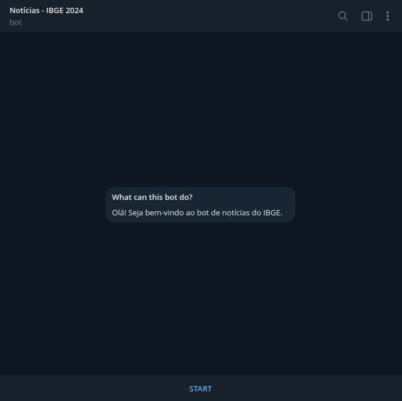
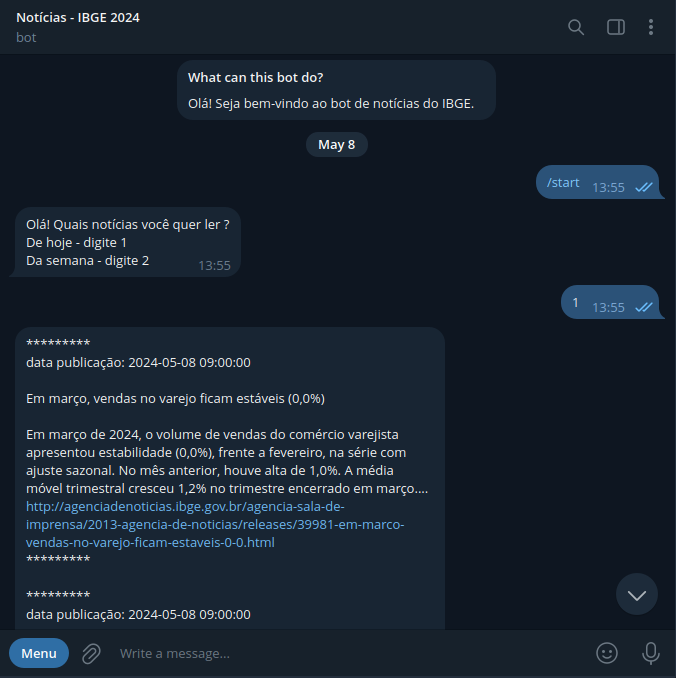
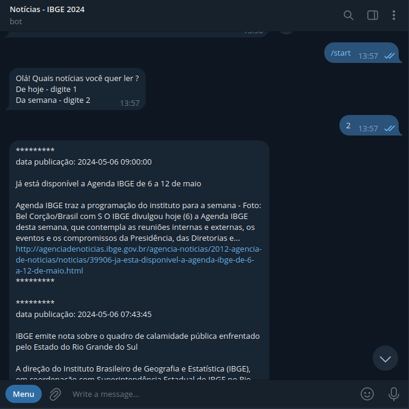
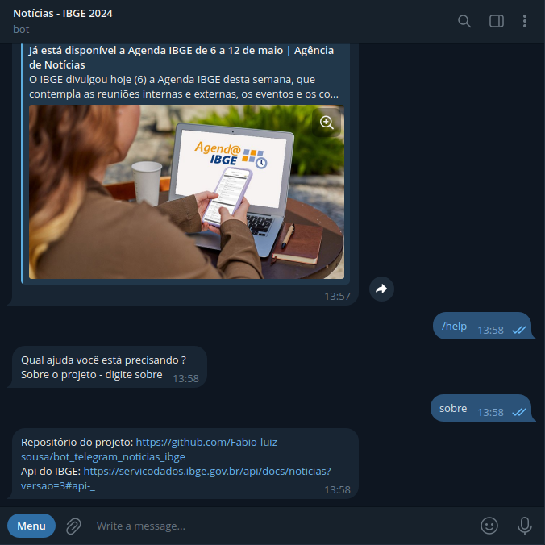

# BOT TELEGRAM NOTÍCIAS IBGE 2024

    

Bot do Telegram que exibe as notícias do IBGE do ano de 2024.

---

### Funcionalidaes
- No comando /start ele mostra a opção de mostrar as notícias do dia e da semana.
- No comando /help ele mostra informações sobre o projeto.

---

### Ferramentas utilizadas
- Python 
- MySQL
- Docker

---

### Estrutura do Projeto
- `bot_noticias_ibge` pasta que contém o script de construção do bot.
- `container_mysql` pasta que contém a configuração para subir um container docker com a imagem do MySQL.
- `get_info_api` pasta que contém o script que lê as notícias da API do IBGE e salva em um json.
- `insert_info_db` pasta que contém os seguintes scripts:
    * `conn_db.py` script que faz a conexão com o servidor do MySQL.
    * `create_db.py` script que cria a tabela no banco de dados para armazenar as notícias.
    * `insert_info_.py` script que insere as notícias na tabela.
    * `select_info.py` script que lê as notícias armazenadas na tabela.
    * `src` pasta quem contém as imagens para o readme. 
---

### Imagens do Bot em funcionamento

<b>Não foi feito o deploy do bot ainda!!!</b>